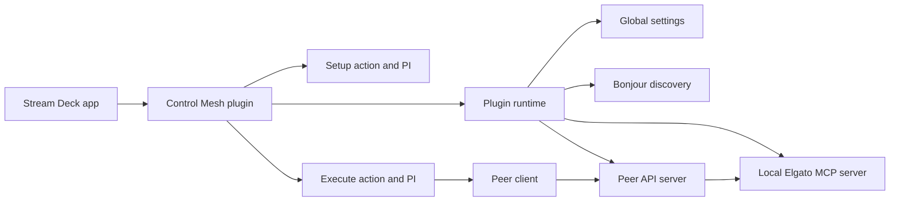

# Control Mesh Developer Guide

## Overview

Control Mesh is a Stream Deck plugin that wraps the official Elgato MCP action
surface with peer discovery, trust, authentication, and Stream Deck-native
configuration UI.

It builds on earlier private iterations and targets the current Elgato Stream
Deck MCP ecosystem.

The plugin stays focused on a small set of responsibilities:

- Elgato MCP defines the available executable actions
- Control Mesh adds peer-to-peer transport and trust on top
- the current deployment model is trusted local-network use

## High-Level Architecture



## Core Concepts

### Node

One Control Mesh plugin instance with a stable internal node id and an
editable user-facing node name.

### Caller

A node that hosts `Execute Remote Action` keys and invokes trusted peers. A
caller does not need local MCP unless it also exposes its own actions.

### Executor

A node that exposes its local Elgato MCP executable actions through the narrow
authenticated peer API.

### Discovered Peer

A transient candidate returned by local-network discovery. Discovery does not
create trust.

### Known Peer

A persisted peer entry stored in global settings. It represents a remote node
known to this node.

### Trust Link

The persisted peer-to-peer relationship containing the shared HMAC secret used
to authenticate requests between two nodes.

### MCP Boundary

Control Mesh does not implement its own action registry or executable-action
allowlist. It lists actions from `streamdeck__get_executable_actions` and
executes them through `streamdeck__execute_action`.

## Runtime Flows

### Discovery

- executor nodes advertise a mesh endpoint over Bonjour/mDNS
- each advertisement includes endpoint, executor-enabled status, node id, node
  name, and plugin version
- caller nodes browse for candidates from the setup UI
- each manual refresh replaces the current discovery snapshot
- self-discovery is filtered out before presenting usable candidates

### Pairing

- a discovered peer receives `POST /pair`
- the receiving setup UI must be open to approve or reject the request
- the accepting node generates the shared secret
- both sides persist the trust link

Known-peer metadata and trust links are stored in Stream Deck global settings.

Caller-only nodes can pair successfully without immediately becoming callable
executors.

### Action Listing

- the caller selects a trusted peer
- the plugin calls the peer's authenticated `GET /actions`
- the executor forwards the request to local Elgato MCP
- returned metadata is adapted for Stream Deck UI display

### Remote Execution

- the caller resolves the trusted peer and trust link
- the request is HMAC-signed
- the executor verifies the signature
- the executor forwards the selected action id to Elgato MCP
- the result or failure is returned upstream

### Session Recovery

Elgato MCP uses Streamable HTTP. If the local MCP session expires and upstream
returns `404`, Control Mesh drops the cached MCP client, recreates it once, and
retries the operation once. `401` and `403` are not retried.

## External Boundaries and Tradeoffs

### Elgato MCP Defines Available Actions

Control Mesh intentionally does not duplicate executable-action eligibility
checks locally. The peer API forwards the selected action id to Elgato MCP.
That keeps the wrapper small and avoids drift from upstream behavior.

### LAN-First Deployment

The intended model is a trusted local network. The plugin does not currently
ship with TLS or public-network hardening.

When executor mode is enabled, the plugin listens on the configured local port,
derives an advertised endpoint from the current machine hostname plus listen
port, and publishes that endpoint over Bonjour/mDNS for nearby peers.

TLS is a future hardening candidate, but not a current priority. The useful
version would require certificate trust design, not just HTTPS transport.

### Stream Deck UI Scope

Control Mesh uses native `sdpi-components` property inspectors instead of a
bundled application-style UI. That keeps the plugin aligned with the Stream
Deck setup model and avoids unnecessary frontend complexity.

## Local Development Workflow

### Tooling

- Node.js `24.16.0`
- pnpm `11.5.0`
- Rollup for Control Mesh build output
- `@workspace/sdpi-components` emitted into the packaged plugin UI folder by
  Rollup

### Main package scripts

From `apps/control-mesh/package.json`:

- `pnpm --filter control-mesh build`
- `pnpm --filter control-mesh run dev`
- `pnpm --filter control-mesh run link`
- `pnpm --filter control-mesh run restart`
- `pnpm --filter control-mesh run validate`
- `pnpm --filter control-mesh run pack`

### Typical local flow

```sh
pnpm --filter control-mesh build
pnpm --filter control-mesh run dev
pnpm --filter control-mesh run link
pnpm --filter control-mesh run restart
```

The build compiles:

- `dev.jerez.sds.control-mesh.sdPlugin/bin/plugin.js`
- `dev.jerez.sds.control-mesh.sdPlugin/ui/control-mesh-setup.js`
- `dev.jerez.sds.control-mesh.sdPlugin/ui/execute-remote-action.js`
- any shared generated UI chunks

The build also emits `ui/sdpi-components.js` from the shared workspace package
so the packaged plugin ships a local SDPI bundle.

## Verification and Packaging Workflow

Workspace-level baseline:

```sh
pnpm format:check
pnpm lint
pnpm typecheck
pnpm test
```

Plugin-specific verification:

```sh
pnpm --filter control-mesh run validate
pnpm --filter control-mesh build
```

Packaging:

```sh
pnpm --filter control-mesh run pack
```

The package script above produces the installer file
`dev.jerez.sds.control-mesh.streamDeckPlugin` from the
`dev.jerez.sds.control-mesh.sdPlugin` directory.
