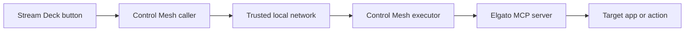
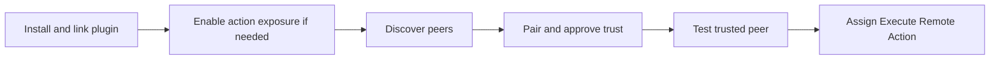

# Control Mesh User Guide

## Before You Start

Control Mesh lets a Stream Deck button on one machine run an Elgato MCP action
on another trusted machine on the same local network.

Before configuring it, you need:

- the Stream Deck desktop app
- the Control Mesh plugin linked or installed on each participating machine
- the official Elgato MCP server available on executor nodes
- a trusted local network between peers

Control Mesh is designed for LAN use. It does not ship with TLS or
internet-facing hardening in this version.

## Common Use Cases

Control Mesh is useful when you want one Stream Deck to trigger actions on a
different nearby machine.

Typical examples:

- trigger an app action on a second computer without moving to that machine
- keep Stream Deck hardware on your main desk while actions execute on another
  machine running the target app
- use one machine as the controller and another as the executor for apps,
  tools, or workflows already exposed through Elgato MCP

If the app or workflow you want to trigger already exists as an executable
Elgato MCP action on the remote machine, Control Mesh can expose that action to
your trusted peers.

## Key Terms

- **This node**: the machine you are configuring right now
- **Peer**: another machine running Control Mesh
- **Expose actions**: allow trusted peers to call this machine's Elgato MCP
  actions
- **Discover**: look for candidate peers on the local network
- **Pair**: explicitly approve and trust another machine
- **Remote action**: an executable action exposed by the peer's Elgato MCP
  server

## How It Works

At a high level, one machine hosts the Stream Deck button and another machine
executes the selected action.



The setup flow is:



## Installation

You can install Control Mesh in two ways:

- development install: link the local
  `dev.jerez.sds.control-mesh.sdPlugin` directory into Stream Deck
- packaged install: install the generated
  `dev.jerez.sds.control-mesh.streamDeckPlugin` installer

### Source Installation

From the workspace root:

```sh
git clone <repository-url> sd-suite
cd sd-suite
nvm install
nvm use
corepack enable
pnpm install
pnpm --filter control-mesh build
pnpm --filter control-mesh run dev
pnpm --filter control-mesh run link
pnpm --filter control-mesh run restart
```

After linking, open Stream Deck and confirm that the action list includes:

- `Control Mesh Setup`
- `Execute Remote Action`

### Packaged Installation

To build an installer from the workspace root:

```sh
pnpm --filter control-mesh build
pnpm --filter control-mesh run pack
```

Install the resulting `dev.jerez.sds.control-mesh.streamDeckPlugin` file in Stream
Deck.

## Configure This Node

Drag `Control Mesh Setup` to a key to open the global configuration UI.

The setup UI uses two tabs:

- **This Node**
- **Mesh**

### This Node

Use this tab to configure the local node:

- **Node name**: editable human-friendly node label. New installs default to
  the current machine hostname.
- **Expose local MCP actions to mesh**: enables executor behavior

When action exposure is enabled, the setup UI also shows:

- **Local MCP URL**
- **Check now** for local MCP validation
- **Listen Port**
- **Mesh endpoint**
- **Network status**

Notes:

- the stable node id is internal and not part of normal setup
- the mesh endpoint is derived from the current machine hostname and configured
  listen port
- enabling **Expose local MCP actions to mesh** advertises that endpoint on the
  local network and allows trusted peers to invoke this node's local Elgato MCP
  actions through the authenticated peer API
- the listen port is validated before saving
- the setup action hides the native Stream Deck title field

To validate local MCP:

1. Start the official Elgato MCP server separately.
2. In Control Mesh Setup, use **Check now** beside the local MCP URL.

## Discover and Pair Peers

Use the **Mesh** tab to browse and trust remote nodes.

### Discovery

`Discover Peers` performs a local-network discovery refresh.

Discovery only finds candidate nodes. It does not create trust by itself. Each
manual refresh replaces the current discovered list. Nodes that are not
rediscovered drop out of the current view.

### Pairing

To pair:

1. Select a discovered peer.
2. Use **Pair**.
3. On the remote machine, keep `Control Mesh Setup` open so the request can be
   approved or rejected.

If pairing is approved:

- the accepting node generates the shared trust secret
- both nodes store the resulting trust link
- the requester stores the reciprocal peer entry and secret

Trust links and peer metadata are stored in Stream Deck global settings for
this plugin.

Caller-only nodes can pair successfully even if they do not expose actions yet.
They become callable remote targets only after action exposure is enabled on
that node.

### Peer Testing

For trusted peers, `Test connection` performs an authenticated health check.
The test confirms the peer only when the returned node id matches the expected
trusted node id. Confirmed and failed results are persisted so the latest peer
status survives reloads.

### Secret Rotation

Trusted peers can rotate their shared secret through the setup UI. Shared
secrets are not shown or edited directly.

## Configure Execute Remote Action

Drag `Execute Remote Action` to a key to configure one remote action call.

Per-key configuration includes:

- **Target Peer**: trusted peer selector
- **Remote Action**: executable action selector for that peer
- **Description**: read-only context from the selected remote action

Behavior notes:

- Control Mesh never sets the Stream Deck key title programmatically
- remote actions shown in the selector come from the peer's official Elgato MCP
  executable-action list
- execution forwards the selected action id to Elgato MCP as the source of
  truth

## Status and Feedback

### Setup Action

The setup action is a configuration action. It exists because Stream Deck does
not provide a standalone plugin settings page for this workflow.

### Execute Remote Action

The execute action uses custom feedback images when Control Mesh owns the key
image:

- active
- success
- error

When a remote action fails, Control Mesh also triggers Stream Deck's built-in
alert feedback so the failure is visible even when custom key images are not.

If the user overrides the key image, Stream Deck gives the user image
precedence, so custom runtime feedback images may not appear.

## Troubleshooting

### Local MCP check fails

Check:

- the MCP server is running
- the local MCP URL points to the correct endpoint
- `http://localhost:9090/health` responds locally on the executor node

Example:

```sh
curl http://localhost:9090/health
```

### Discovery finds nothing

Check:

- both machines are on the same local network
- the executor node has **Expose local MCP actions to mesh** enabled
- the executor node is running Control Mesh and advertising
- you refreshed discovery from the Mesh tab

### Pairing request never completes

Check:

- `Control Mesh Setup` is open on the receiving peer
- the peer is reachable on the local network
- you are pairing the intended node, not a stale discovery result

### Remote action list is empty

Check:

- the peer is trusted and confirmed
- the peer exposes actions to the mesh
- the peer's local Elgato MCP server is running
- the peer's MCP server actually reports executable actions

### Remote execution fails

Check:

- the trusted peer entry still points to the current node
- the peer test succeeds
- the selected remote action still exists upstream

Control Mesh does not keep its own executable-action allowlist. If an action is
no longer executable, the failure comes from Elgato MCP.

### Intermittent MCP failures after idle time

Elgato MCP uses Streamable HTTP and may expire a session. Control Mesh treats
an upstream `404` session-loss response as recoverable and recreates the local
MCP client once before retrying. `401` and `403` are treated as authentication
or authorization failures and are not retried.
